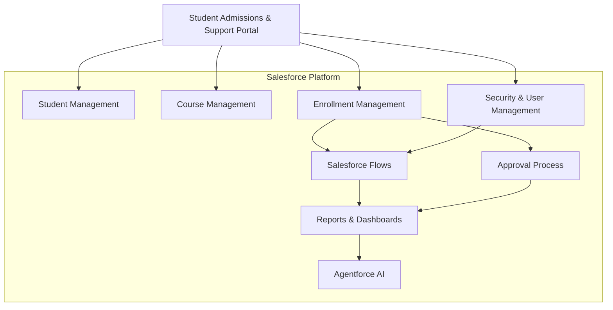

# High-Level Architecture

## Components

### Student Management

- Student Records
- Student Details
- Admission Status

### Course Management

- Courses
- Capacity
- Course Information

### Enrollment Management

- Student Enrollment
- Approval Workflow
- Enrollment Status

### Automation

- Salesforce Flow
- Approval Process
- Email Notifications

### Security

- Profiles
- Roles
- Permission Sets
- Sharing Rules

### Analytics

- Reports
- Dashboards

### Artificial Intelligence

- Agentforce
- Counselor Assistance
- AI Recommendations
- Record Summaries

## Technology Stack

| Layer | Technology |
|---|---|
| CRM Platform | Salesforce |
| Automation | Flow Builder |
| Security | Profiles, Roles, Permission Sets |
| Analytics | Reports & Dashboards |
| AI | Agentforce |
| Development | Salesforce DX |
| Version Control | Git & GitHub |
